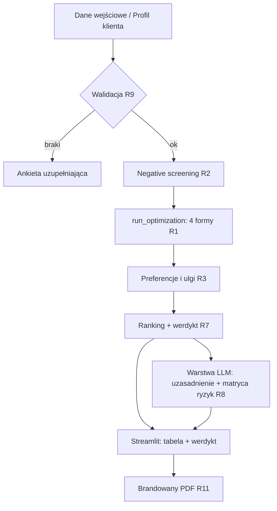

# feat: Silnik Optymalizacji Podatkowej 2026 (Streamlit MVP)

## Przegląd

Narzędzie doradcze dla biura Abacus, które dla danej JDG porównuje cztery formy opodatkowania na rok 2026 (skala, liniowy, ryczałt, sp. z o.o.), wskazuje najkorzystniejszą i produkuje brandowany PDF do sesji doradczej z klientem. Kluczowa zasada architektoniczna: **cała matematyka jest deterministyczna (Python), a model językowy generuje wyłącznie warstwę narracyjną** (uzasadnienie + matryca ryzyk) na podstawie gotowych liczb. Spec to dopracowany prompt z tej sesji; w MVP staje się on specyfikacją silnika + instrukcją dla warstwy LLM, a nie kalkulatorem.

## Ujęcie problemu

Podczas sesji doradczych (listopad–grudzień, pilotaż wrzesień 2026) doradca potrzebuje w kilka minut policzyć i porównać formy opodatkowania dla konkretnego klienta i wręczyć mu wiarygodny, brandowany dokument. Liczenie ręczne jest wolne i podatne na błędy, a oddanie matematyki modelowi językowemu grozi zaokrągleniami i gubieniem progów — przy rekomendacji, którą klient traktuje jako twardą, to niedopuszczalne. Potrzebny jest deterministyczny silnik z testami, oddzielony od UI i od narracji.

## Śledzenie wymagań

- R1. Deterministyczne policzenie czterech form wg parametrów 2026: skala, liniowy, ryczałt, sp. z o.o.
- R2. Negative screening: `byly_pracodawca`=TRUE blokuje ryczałt i liniowy; przychód > 2 mln EUR blokuje ryczałt.
- R3. Obsługa wspólnego rozliczenia (próg 240 000 zł, podwójna kwota wolna 60 000 zł) oraz ulg: dzieci, 4+, IP-Box (5%), IKZE.
- R4. Poprawny rok składkowy zdrowotny: minimum roczne = 5 072,90 zł (1×314,96 + 11×432,54); limit odliczenia liniowy 14 100 zł; ryczałt — 50% zapłaconej zdrowotnej pomniejsza przychód.
- R5. ZUS wg parametru (Duży / Mały ZUS Plus / Preferencyjny / Ulga na start / Etat-zbieg) z rocznym ograniczeniem podstawy emerytalno-rentowej 282 600 zł.
- R6. Sp. z o.o.: jawne założenie wypłaty (np. 100% zysku dywidendą), wyjątek jednoosobowej sp. z o.o. (dodatkowa zdrowotna + ZUS wspólnika), opcjonalna ścieżka art. 176 KSH.
- R7. Wyjście zgodne z kontraktem UI: tabela porównawcza, werdykt matematyczny, max 3 punkty uzasadnienia, matryca ryzyk; styl menedżerski per „Pan/Pani".
- R8. Warstwa LLM generuje wyłącznie narrację z gotowych liczb — nie wykonuje obliczeń.
- R9. Walidacja danych wejściowych: przy braku przychodu / kosztów / kodu PKWiU lub charakteru usług — zatrzymanie i konkretna ankieta uzupełniająca.
- R10. „Profil klienta": zapis i odczyt parametrów klienta (Supabase).
- R11. Brandowany PDF (styl Abacus, gradient navy `#0d1b2a → #1b2d45`) jako deliverable sesji.

## Granice scope'u

- **Estoński CIT i ewentualna piąta forma — poza MVP.** Dopracowany prompt obejmuje 4 formy; wcześniejszy stress-test narzędzia wspominał o 5 formach i trzech rankingach. Do potwierdzenia przed implementacją (zob. Otwarte pytania). MVP planowany pod 4 formy.
- Brak multi-user / auth — narzędzie jednostanowiskowe na sesje doradcze.
- Brak automatycznej integracji z Enova365 / Frappe CRM — dane wprowadzane ręcznie lub z „Profilu klienta". Integracja to osobny etap.
- Brak automatycznego pobierania stawki ryczałtu z PKWiU — doradca wskazuje stawkę (z podpowiedzią).
- Brak rozliczeń wstecznych / korekt — narzędzie liczy prognozę na rok 2026.

## Kontekst i research

### Relevantny kod i wzorce (z ekosystemu Abacus)

- **Wzorzec „pure engine + UI"**: `run_audit` z audytora KPiR oraz `symfonia_year_end_auditor.py` — czysta funkcja obliczeniowa oddzielona od Streamlit. Powielić jako `run_optimization(dane) -> WynikOptymalizacji`.
- **Branding**: gradient navy `#0d1b2a → #1b2d45` ustalony w audytorze Symfonia i powielany w kolejnych narzędziach — użyć w UI i PDF.
- **Supabase przez HTTPS**: w „Generator masowych pism" port 5432 był zablokowany, więc dostęp idzie przez `supabase-py` po HTTPS. Tę samą ścieżkę przyjąć dla „Profilu klienta".
- **Warstwa AI z narracją + wizualizacjami**: „Generator Sprawozdań Zarządu" (Claude API + python-docx + matplotlib, narracja AI + 3 wizualizacje) — wzorzec dla warstwy LLM i dla PDF.
- **Dziennik decyzji / reguły**: „Analyzer Oszczędności" — wzorzec rozdzielenia reguł systemowych od danych; może posłużyć przy parametryzacji 2026.

### Referencje zewnętrzne (parametry 2026, zweryfikowane)

- Minimalna składka zdrowotna 432,54 zł/mies od lutego 2026 (ZUS); 314,96 zł za styczeń 2026 (koniec starego roku składkowego).
- Limit odliczenia zdrowotnej liniowy: 14 100 zł (Obwieszczenie MF z 12.12.2025, M.P. poz. 1274).
- Ryczałt — zdrowotna od 60/100/180% przeciętnego (9 228,64 zł): 498,35 / 830,58 / 1 495,04 zł mies.
- Duży ZUS społeczne (z chorobowym + FP) 1 926,76 zł/mies (podstawa 5 652,00 zł); preferencyjny 456,18 zł; Mały ZUS Plus 456–1 927 zł.
- Roczne ograniczenie podstawy emerytalno-rentowej 282 600 zł. Reforma składki zdrowotnej zawetowana — obowiązuje konstrukcja z Polskiego Ładu.

## Kluczowe decyzje techniczne

- **Rozdział silnik / narracja / UI**: deterministyczny rdzeń, warstwa LLM tylko narracyjna, Streamlit jako prezentacja. Uzasadnienie: poprawność liczb i testowalność rdzenia niezależnie od modelu i UI.
- **Stałe 2026 w jednym module**: wszystkie parametry roczne w jednym `params_2026.py`/strukturze, by aktualizacja na 2027 była jednym miejscem zmiany.
- **Minimum zdrowotnej jako stała 5 072,90 zł**: zaszyta i pokryta testem, by model ani kod nie policzył 12×432,54.
- **Supabase po HTTPS (`supabase-py`)**: zgodnie z ograniczeniem portu 5432 z wcześniejszych narzędzi.
- **Graceful degradation warstwy LLM**: jeśli API niedostępne, narzędzie i tak pokazuje tabelę + werdykt (liczby), a sekcje narracyjne oznacza jako niedostępne.

## Otwarte pytania

### Rozwiązane podczas planowania

- Architektura silnik vs LLM: rozdzielone (silnik liczy, LLM opisuje).
- Minimum zdrowotnej: 5 072,90 zł jako stała.
- Dostęp do Supabase: HTTPS przez `supabase-py`.

### Wymagające decyzji przed implementacją (blokujące scope)

- **4 czy 5 form?** MVP zaplanowany pod 4 formy zgodnie z promptem. Jeśli pilotaż wymaga estońskiego CIT i trzech rankingów (jak w starszym stress-teście), zwiększa to scope Unitów 1, 2, 5, 6 — wymaga potwierdzenia.

### Odroczone do implementacji

- Wybór biblioteki PDF (reportlab vs HTML→PDF/WeasyPrint) — zależny od jakości brandingu i wizualizacji.
- Dokładny model „Profilu klienta" w Supabase (kolumny stałe vs EAV) — po dotknięciu istniejącego schematu z innych narzędzi.
- Dokładny kształt wizualizacji w PDF (jeśli w ogóle w MVP).

## Diagram przepływu

## Implementation Units

- [ ] **Unit 1: Stałe podatkowe 2026 + modele danych**

**Cel:** Jedno źródło prawdy dla parametrów 2026 oraz typowane modele wejścia/wyjścia silnika.

**Wymagania:** R4, R5

**Zależności:** Brak

**Pliki:**
- Stwórz: `optymalizator/params_2026.py`
- Stwórz: `optymalizator/models.py`
- Test: `tests/test_models.py`

**Podejście:**
- W `params_2026.py`: minimalne wynagrodzenie 4 806, przeciętne 9 420, przeciętne sektor IV kw. 9 228,64, minimum zdrowotnej roczne 5 072,90, progi/stawki skali (12%/32%, próg 120 000, kwota zmniejszająca 3 600), limit odliczenia liniowy 14 100, progi ryczałtu (498,35/830,58/1 495,04), kwoty ZUS (Duży 1 926,76; Preferencyjny 456,18; podstawy Mały ZUS Plus 1 441,80–5 652,00), roczne ograniczenie podstawy 282 600, CIT 9%, efektywne dywidendy 0,7371.
- W `models.py`: `DaneKlienta` (przychód, koszty, stawka_ryczałtu/charakter usług, forma ZUS, flagi: byly_pracodawca, wspolne_rozliczenie, ulgi, art_176, jednoosobowa_spzoo, dochód małżonka), `WynikFormy` (podatek, zdrowotna, zus_spoleczny, dochod_netto, dostepnosc), `WynikOptymalizacji` (lista WynikFormy, werdykt, różnica do drugiej opcji).

**Wzorce do naśladowania:**
- `analyzer/models.py` (Analyzer Oszczędności) — styl dataclass/pydantic.

**Scenariusze testowe:**
- Stałe mają oczekiwane wartości (regresja na liczbach 2026).
- Model wejścia odrzuca brak wymaganych pól zgodnie z R9.

**Weryfikacja:**
- Import modułu zwraca komplet stałych 2026; modele walidują się poprawnie.

---

- [ ] **Unit 2: Silnik deterministyczny `run_optimization`**

**Cel:** Czysta funkcja licząca cztery formy, screening, preferencje i werdykt — bez UI i bez LLM.

**Wymagania:** R1, R2, R3, R4, R6, R7 (część liczbowa)

**Zależności:** Unit 1

**Pliki:**
- Stwórz: `optymalizator/engine.py` (sygnatura projektowa: `run_optimization(dane: DaneKlienta) -> WynikOptymalizacji`)
- Test: `tests/test_engine.py`

**Podejście:**
- Wzór nadrzędny identyczny dla wszystkich: `dochód_netto = przychód − koszty − zus_spoleczny − zdrowotna − podatek`.
- Skala: D = przychód−koszty−ZUS; podatek 12%×min(D,120k)−3 600 lub 10 800+32%×(D−120k), nie <0, minus ulgi; zdrowotna 9%×D nie mniej niż minimum; brak odliczenia.
- Liniowy: zdrowotna 4,9%×D, minimum; odliczenie = min(zdrowotna, 14 100) pomniejsza D; podatek 19%.
- Ryczałt: **koszty nie wchodzą do podstawy**; podstawa = przychód − ZUS − 50%×zdrowotna; podatek = stawka×podstawa; zdrowotna stała wg progu.
- Sp. z o.o.: CIT 9%, dywidenda efektywnie 26,29% (mnożnik 0,7371); jawne założenie wypłaty; wyjątek jednoosobowej (dodatkowa zdrowotna + ZUS); ścieżka art. 176 jeśli flaga.
- Screening (Krok 1) i preferencje/ulgi/wspólne rozliczenie (Krok 2) jako osobne, czyste sub-funkcje wołane wewnątrz `run_optimization`.

**Notatka wykonawcza:** Zacznij test-first — to rdzeń finansowy, poprawność liczb jest krytyczna. Najpierw failing testy na scenariuszach poniżej, potem implementacja.

**Wzorce do naśladowania:**
- `run_audit` (audytor KPiR) — pure-function, oddzielenie logiki od UI.

**Scenariusze testowe:**
- Wysoki dochód, niskie koszty → ryczałt korzystniejszy niż skala/liniowy.
- Wysokie koszty → skala/liniowy biją ryczałt (bo ryczałt nie odejmuje kosztów).
- `byly_pracodawca`=TRUE → ryczałt i liniowy oznaczone NIEDOSTĘPNE; werdykt tylko spośród dostępnych.
- Przychód > 2 mln EUR → ryczałt NIEDOSTĘPNY.
- Wspólne rozliczenie, małżonek bez dochodu → skala zyskuje przez podwójną kwotę wolną i próg.
- Dochód bardzo niski / strata → zdrowotna = minimum 5 072,90 zł (NIE 12×432,54).
- Liniowy, zapłacona zdrowotna > 14 100 → odliczenie capped na 14 100.
- Ryczałt II próg (830,58) → 50% zapłaconej zdrowotnej pomniejsza przychód.
- Jednoosobowa sp. z o.o. → doliczona zdrowotna + ZUS wspólnika; wynik różny od wieloosobowej.
- Dochód przekraczający 282 600 → emerytalna/rentowa naliczone do limitu.

**Weryfikacja:**
- Wszystkie scenariusze przechodzą; werdykt zwraca poprawną różnicę kwotową do drugiej opcji; suma kontrolna minimum zdrowotnej = 5 072,90 zł.

---

- [ ] **Unit 3: Profil klienta + Supabase (CRUD)**

**Cel:** Zapis/odczyt parametrów klienta, by doradca nie wprowadzał wszystkiego ręcznie na sesji.

**Wymagania:** R10

**Zależności:** Unit 1

**Pliki:**
- Stwórz: `optymalizator/profil_repo.py`
- Test: `tests/test_profil_repo.py` (z mockiem klienta Supabase)

**Podejście:**
- Dostęp przez `supabase-py` po HTTPS (port 5432 zablokowany — jak w „Generator masowych pism").
- NIP jako klucz unikalny profilu (spójnie z bazą klientów z innych narzędzi).
- Mapowanie profil ↔ `DaneKlienta`.

**Wzorce do naśladowania:**
- Warstwa Supabase z „Generator masowych pism" (klient HTTPS, import po NIP).

**Scenariusze testowe:**
- Zapis nowego profilu i odczyt po NIP zwraca te same dane.
- Odczyt nieistniejącego NIP zwraca None / pusty wynik bez wyjątku.

**Weryfikacja:**
- CRUD działa na mocku; realna integracja odroczona do testu z instancją Supabase.

---

- [ ] **Unit 4: Warstwa narracyjna LLM**

**Cel:** Wygenerować „Kluczowe Uzasadnienie" (max 3 punkty) i „Matrycę Ryzyk" z gotowych liczb, w stylu per „Pan/Pani".

**Wymagania:** R7 (narracja), R8

**Zależności:** Unit 2

**Pliki:**
- Stwórz: `optymalizator/narracja.py`
- Test: `tests/test_narracja.py`

**Podejście:**
- Wejście: `WynikOptymalizacji` (gotowe liczby) → prompt strukturalny (część narracyjna dopracowanego specu) → Claude API (model klasy Sonnet).
- Model NIE liczy — w prompcie zakaz przeliczania, dostaje liczby jako dane.
- Graceful degradation: brak/awaria API → zwróć placeholdery i flagę „narracja niedostępna", UI/PDF pokazują liczby.

**Wzorce do naśladowania:**
- Warstwa AI z „Generator Sprawozdań Zarządu" (Claude API + narracja).

**Scenariusze testowe:**
- Dla ustalonego `WynikOptymalizacji` zwraca ≤3 punkty uzasadnienia i sekcję ryzyk (mock API).
- Awaria API → degradacja bez crasha, flaga ustawiona.

**Weryfikacja:**
- Narracja spójna z werdyktem; brak prób przeliczeń; degradacja działa.

---

- [ ] **Unit 5: UI Streamlit**

**Cel:** Formularz wejściowy + dropdown „Profil klienta" + checkboxy ulg, render tabeli porównawczej i werdyktu w brandingu Abacus.

**Wymagania:** R3, R7, R9, R10

**Zależności:** Unit 1, 2, 3, 4

**Pliki:**
- Stwórz: `app.py`
- Stwórz: `optymalizator/ui_components.py`
- Test: `tests/test_ui_smoke.py` (smoke / import)

**Podejście:**
- Formularz: przychód, koszty, charakter usług / stawka ryczałtu, forma ZUS (radio), flagi (były pracodawca, wspólne rozliczenie, jednoosobowa sp. z o.o., art. 176), checkboxy ulg, dochód małżonka.
- „Profil klienta" — dropdown z Supabase (Unit 3); wybór wypełnia formularz.
- Walidacja R9: przy brakach — komunikat + konkretna ankieta, bez liczenia.
- Render: tabela 4 form, werdykt, sekcje narracyjne z Unit 4; gradient navy `#0d1b2a → #1b2d45`.

**Wzorce do naśladowania:**
- Streamlit + branding z audytora Symfonia; multipage z „Generator masowych pism".

**Scenariusze testowe:**
- Wprowadzenie kompletnych danych → tabela + werdykt renderują się.
- Brak kosztów / PKWiU → ankieta, brak obliczeń.
- Wybór profilu z dropdownu wypełnia pola.

**Weryfikacja:**
- Aplikacja startuje, happy-path renderuje wynik, walidacja blokuje braki.

---

- [ ] **Unit 6: Generator brandowanego PDF**

**Cel:** Wyeksportować wynik sesji jako brandowany PDF (Abacus) — deliverable dla klienta.

**Wymagania:** R11

**Zależności:** Unit 2, 4, 5

**Pliki:**
- Stwórz: `optymalizator/pdf_export.py`
- Test: `tests/test_pdf_export.py`

**Podejście:**
- Sekcje: nagłówek z brandingiem, tabela porównawcza, werdykt matematyczny, uzasadnienie, matryca ryzyk.
- Styl per „Pan/Pani"; gradient/navy Abacus; stopka z zastrzeżeniem doradczym.
- Biblioteka PDF — odroczone (reportlab vs HTML→PDF); decyzja po próbie brandingu.

**Wzorce do naśladowania:**
- PDF/branding z narzędzi Abacus; matplotlib z „Generator Sprawozdań Zarządu" jeśli wizualizacje wejdą.

**Scenariusze testowe:**
- Dla ustalonego wyniku generuje niepusty PDF z wszystkimi sekcjami.
- Degradacja narracji (Unit 4) → PDF nadal zawiera tabelę i werdykt.

**Weryfikacja:**
- PDF otwiera się, zawiera komplet sekcji i branding.

## Wpływ systemowy

- **Graf interakcji:** UI → engine → narracja → pdf; profil_repo czytany przy starcie i przy wyborze klienta.
- **Propagacja błędów:** błąd LLM nie może wywrócić liczenia ani PDF; błąd Supabase nie blokuje ręcznego wprowadzania danych.
- **Ryzyka cyklu życia stanu:** stan formularza w `st.session_state`; uwaga na nadpisanie pól przy wyborze profilu.
- **Parytet API:** kontrakt `WynikOptymalizacji` współdzielony przez UI i PDF — jedna zmiana, oba konsumenty.

## Ryzyka i zależności

- **Poprawność podatkowa** — najwyższe ryzyko; mitygacja: test-first w Unit 2, stałe 2026 w jednym miejscu, suma kontrolna minimum zdrowotnej.
- **Sp. z o.o. nieporównywalna 1:1 z JDG** — wynik zależy od założenia wypłaty; mitygacja: jawne wyświetlanie założenia, nie udawać jednej pewnej liczby.
- **Zależność od zewnętrznego API (Claude, Supabase)** — mitygacja: graceful degradation w obu.
- **Scope 4 vs 5 form** — może urosnąć; zablokowane do potwierdzenia.

## Rozważane alternatywy

- **Liczenie przez LLM (prompt jako kalkulator)** — odrzucone: ryzyko zaokrągleń i gubienia progów w narzędziu o charakterze rekomendacji.
- **PostgreSQL bezpośrednio (port 5432)** — odrzucone: zablokowany w środowisku; stąd Supabase po HTTPS.

## Fazowe dostarczanie

- **Faza 1 (rdzeń):** Unit 1 + Unit 2 — silnik z testami; już użyteczny do walidacji liczb (np. odpalany lokalnie/CLI).
- **Faza 2 (sesja):** Unit 3 + Unit 5 — UI z profilami; doradca może liczyć na sesji.
- **Faza 3 (deliverable):** Unit 4 + Unit 6 — narracja i brandowany PDF.

## Źródła i referencje

- Dokument źródłowy: dopracowany prompt „Silnik Optymalizacji Podatkowej 2026" (pełna wersja z tej sesji).
- Parametry 2026: ZUS, Obwieszczenie MF z 12.12.2025 (M.P. poz. 1274), obwieszczenia GUS.
- Wzorce ekosystemu Abacus: `run_audit` (audytor KPiR), `symfonia_year_end_auditor.py`, Generator Sprawozdań Zarządu, Generator masowych pism, Analyzer Oszczędności.

---

# Aktualizacja #2 (2026-06-22): Prezentacja oszczędności sp. z o.o. + reinwestycja

Ta sekcja rozszerza i nadpisuje fragmenty powyżej. Decyzje poniżej są zatwierdzone.

## Zatwierdzone decyzje

- **Oszczędność ZUS prezentowana BRUTTO**: pełny ZUS społeczny z JDG pokazywany jako zniknięta pozycja (przewaga spółki), z **osobną, obowiązkową linią „ZUS od etatu w spółce"** na tym samym widoku. Guardrail: linia etatu nie może zostać pominięta — inaczej liczba brutto wprowadza w błąd.
- **Rekomendowana struktura przy wygranej spółki = 2-osobowa sp. z o.o. + wspólnik(y) na części etatu** (np. 1/2). Etat rozwiązuje NFZ i odbudowuje część emerytury, i jest warunkiem działania IKZE oraz PPK.
- **Połowa „pracująca" oszczędności → mix IKE + IKZE wg progu** pracownika, z limitami 2026.
- Oszczędność ZUS małżonka traktowana analogicznie (brutto), gdy małżonek wnoszony do spółki.

## Nowe / rozszerzone wymagania

- **R6 (rozszerzone):** sp. z o.o. modelowana jako pakiet „spółka + etat". Pensja etatowa jest jednocześnie: kosztem spółki (obniża CIT i dywidendę), dochodem opodatkowanym skalą u pracownika, oraz podstawą ZUS i zdrowotnej od pensji.
- **R12:** Silnik zwraca rozbicie każdej formy na składniki (podatek / ZUS społeczny / składka zdrowotna), by policzyć źródła przewagi.
- **R13:** Gdy rekomendacją jest sp. z o.o. — „waterfall oszczędności": pełny ZUS JDG znika (+) → ZUS od etatu dochodzi (−) → zdrowotna JDG znika (+) → zdrowotna od etatu dochodzi (−) → oszczędność netto. Analogiczny blok dla małżonka, gdy włączony.
- **R14:** Moduł reinwestycji: 50% oszczędności → IKE/IKZE (mix wg progu, limity 2026), 50% pozostaje gotówką; wzrost „pracującej" połowy prezentowany w widełkach (scenariusze stóp zwrotu, konfigurowalny horyzont); opcjonalnie PPK przy etacie. Obowiązkowy disclaimer „nie stanowi doradztwa inwestycyjnego".
- **R15:** Przełącznik „małżonek wnoszony do spółki jako wspólnik" — domyślnie wyłączony. Po włączeniu modeluje na poziomie pary: dochód małżonka wchodzi do spółki (zwiększa CIT/dywidendę), jego ZUS z JDG liczony jako oszczędność (brutto), limity IKE/IKZE podwojone.

## Aktualizacja Unit 1 (stałe 2026)

Dodać do `params_2026.py`:
- Limity trzeciego filaru 2026: IKE 28 260 zł; IKZE (etat / nieprowadzący działalności) 11 304 zł; IKZE (działalność, art. 8 ust. 6) 16 956 zł — używany tylko w wariancie, w którym klient zachowuje JDG.
- Przeciętne prognozowane wynagrodzenie 9 420 zł (podstawa limitów).
- PPK: stawki ustawowe (pracownik 2% + pracodawca 1,5% podstawowo; dopłaty państwa: wpłata powitalna i dopłata roczna) — wartości dokładne do potwierdzenia w implementacji.
- **Pułapka do zaszycia w logice:** wspólnik sp. z o.o. na etacie NIE jest „prowadzącym działalność", więc traci limit IKZE 16 956 i wraca do 11 304 zł.

## Aktualizacja Unit 2 (silnik)

- `WynikFormy` udostępnia składniki (podatek, zus_spoleczny, zdrowotna) — już przewidziane; potwierdzić jako kontrakt publiczny.
- Dla sp. z o.o. dodać pola pakietu „spółka + etat": pensja_etat, zus_od_etatu, zdrowotna_od_etatu, koszt_pensji_w_spolce, marginalna_stawka_etatu.
- Sub-funkcja licząca strukturę spółka+etat (pensja jako koszt → niższy CIT/dywidenda; ZUS i zdrowotna od pensji; PIT skali od pensji).

**Dodatkowe scenariusze testowe:**
- Etat 1/2 płacy minimalnej → ZUS i zdrowotna od etatu policzone od właściwej podstawy.
- Pensja etatowa obniża podstawę CIT i kwotę dywidendy.
- Marginalna stawka etatu wyznaczona poprawnie (12% przy niskim etacie).

## Implementation Units (nowe)

- [ ] **Unit 7: Rozbicie przewagi + waterfall oszczędności**

**Cel:** Policzyć i wyeksponować, z czego wynika przewaga sp. z o.o. (podatek vs ZUS vs zdrowotna), w formie waterfalla brutto z osobną linią etatu.

**Wymagania:** R12, R13

**Zależności:** Unit 2

**Pliki:**
- Stwórz: `optymalizator/oszczednosci.py`
- Test: `tests/test_oszczednosci.py`

**Podejście:**
- `rozbij_przewage(wynik_spzoo, wynik_najlepszej_jdg) -> RozbicieOszczednosci` zwraca uporządkowane linie: ZUS JDG (+), ZUS od etatu (−), zdrowotna JDG (+), zdrowotna od etatu (−), różnica podatku, netto.
- Guardrail kodowy: linia „ZUS od etatu" zawsze obecna w wyniku, nawet gdy 0 (z flagą widoczności true).
- Analogiczny blok dla małżonka, gdy R15 włączone.

**Scenariusze testowe:**
- Spółka wygrywa → suma linii waterfalla = różnica netto względem najlepszej JDG.
- ZUS od etatu niezerowy i obecny jako osobna linia.
- Z włączonym małżonkiem → drugi blok oszczędności policzony.

**Weryfikacja:** Rozbicie sumuje się do różnicy netto; linia etatu nigdy nie znika.

---

- [ ] **Unit 8: Moduł reinwestycji IKE/IKZE/PPK**

**Cel:** Pokazać, co dzieje się z oszczędnością: połowa do gotówki, połowa „pracuje" w trzecim filarze, w widełkach.

**Wymagania:** R14

**Zależności:** Unit 7

**Pliki:**
- Stwórz: `optymalizator/reinwestycja.py`
- Test: `tests/test_reinwestycja.py`

**Podejście:**
- Podział oszczędności 50/50: gotówka vs filar.
- Alokacja filaru wg progu (reguła domyślna): marginalna stawka etatu 32% lub liniowy → najpierw IKZE do limitu, nadwyżka na IKE; stawka 12% → głównie IKE, IKZE tylko do wysokości realnego odliczenia. Twarde ograniczenia: IKE ≤ 28 260, IKZE ≤ 11 304 na osobę (×2 para); odliczenie IKZE ≤ dochód skali z etatu; nadwyżka ponad limity wraca do gotówki.
- Projekcja: wzrost „pracującej" połowy w widełkach (np. realne 4% i 6%), horyzont konfigurowalny; wynik jako zakres, nie pojedyncza liczba.
- PPK: opcjonalne, aktywne tylko gdy etat = TRUE; stawki ustawowe + dopłaty państwa; część pracodawcy jako koszt spółki.
- Disclaimer „nie stanowi doradztwa inwestycyjnego" zwracany razem z wynikiem (do wyświetlenia w UI i PDF).

**Scenariusze testowe:**
- Niski etat (12%) → alokacja głównie na IKE.
- Wysoki etat / liniowy → IKZE wypełnione w pierwszej kolejności.
- Oszczędność > suma limitów → nadwyżka pozostaje w gotówce.
- Para (R15) → limity podwojone.
- Brak etatu → IKZE bez wartości odliczenia, kierowanie na IKE; PPK niedostępne.

**Weryfikacja:** Alokacja respektuje limity i regułę progu; projekcja zwraca zakres z disclaimerem.

## Aktualizacja Unit 5 i Unit 6 (UI + PDF)

- Render waterfalla oszczędności (Unit 7) z widoczną linią etatu.
- Sekcja reinwestycji (Unit 8): podział 50/50, alokacja IKE/IKZE, widełki projekcji, opcjonalne PPK.
- Przełącznik „małżonek wnoszony do spółki" (R15) w formularzu.
- Disclaimer inwestycyjny w stopce PDF i pod sekcją reinwestycji w UI.

## Dodatkowe ryzyka

- Struktura 2-osobowa bez realnego drugiego wspólnika (układy typu 99/1) bywa kwestionowana przez ZUS — wyświetlać razem z kwotą oszczędności.
- Projekcja inwestycyjna jest ilustracją; biuro nie świadczy doradztwa inwestycyjnego — disclaimer obowiązkowy.
- Utrata wyższego limitu IKZE (16 956 → 11 304) po przejściu z JDG na etat w spółce.
- Oszczędność ZUS oznacza niższą emeryturę z ZUS — częściowo nadrabianą etatem i reinwestycją; pokazać jako kontekst, nie ukrywać.

---

# Aktualizacja #3 (2026-06-22): Tryb prezentacji — rekomendacje, porównania, pokrętła

Rozstrzygnięcie sposobu, w jaki decyzje trafiają do interfejsu. Zasada nadrzędna: nie zamieniać każdej decyzji w pytanie ani w osobny wariant (eksplozja kombinacji i nieczytelny raport). Rozdzielamy decyzje na trzy kategorie.

## Kategoryzacja decyzji

**A. Domyślne rekomendacje (bez wyboru, z widocznym uzasadnieniem):**
- Prezentacja oszczędności ZUS: zawsze waterfall brutto z obowiązkową linią etatu (z definicji pokazuje brutto i netto naraz). NIE jest przełącznikiem — przełącznik odtworzyłby tryb „schowaj etat".
- Alokacja połowy „pracującej": „mix IKE+IKZE wg progu" jako rekomendacja wyróżniona.

**B. Porównanie obok siebie (realny trade-off, który klient chce zobaczyć):**
- IKE vs IKZE: liczone trzy alokacje na tych samych danych — IKE-only, IKZE-only, mix wg progu. Mix oznaczony jako rekomendowany; dwa czyste warianty jako materiał do rozmowy. W PDF wersja kompaktowa (rekomendacja + skrót porównania), pełne porównanie w UI.

**C. Pokrętła doradcy (przeliczają wynik na żywo; zależne od konkretnego klienta):**
- Małżonek wnoszony do spółki: wł/wył (domyślnie wył).
- Poziom etatu wspólnika: 1/4, 1/2 (domyślnie), 3/4, pełny.
- Proporcja podziału oszczędności: domyślnie 50/50, regulowana.
- Stopa zwrotu projekcji: domyślnie dwa scenariusze 4% i 6% realnie; regulacja ograniczona do zakresu 2–8% realnie (twardy limit, by uniknąć fantazyjnych wyników).

## Nowe / rozszerzone wymagania

- **R14 (rozszerzone):** moduł reinwestycji liczy trzy alokacje (IKE-only / IKZE-only / mix) i zwraca je razem, z oznaczeniem mix jako rekomendacji. Stopa zwrotu i proporcja podziału są parametrami wejścia, nie stałymi.
- **R16:** Parametry sytuacyjne (małżonek, poziom etatu, proporcja podziału, stopa zwrotu) są wejściami sterowanymi z UI; każda zmiana przelicza wynik bez przeładowania. Stopa zwrotu ograniczona do 2–8% realnie.
- **R17:** Rozdział widoku: UI pokazuje pełne porównanie IKE/IKZE i wszystkie pokrętła; PDF pokazuje wynik dla aktualnych ustawień + kompaktowe porównanie IKE/IKZE, bez ekspozycji pokręteł (czysty, 4-stronicowy deliverable).

## Wpływ na Unity

- **Unit 5 (UI):** dodać pokrętła kategorii C (małżonek, poziom etatu, proporcja, stopa zwrotu z ograniczonym suwakiem), render porównania IKE/IKZE (trzy alokacje, mix wyróżniony), przeliczanie na żywo. Waterfall ZUS bez przełącznika.
- **Unit 6 (PDF):** render rekomendacji (mix) + kompaktowe porównanie IKE/IKZE; odzwierciedla aktualne ustawienia pokręteł; bez samych pokręteł; disclaimer inwestycyjny w stopce.
- **Unit 8 (reinwestycja):** `oblicz_reinwestycje(oszczednosc, marginalna_stawka, proporcja, stopy_zwrotu, horyzont, limity) -> WynikReinwestycji` zwracający trzy alokacje + projekcje w widełkach. Stopa zwrotu walidowana do 2–8% realnie. Proporcja i stopa jako parametry, nie stałe.

**Dodatkowe scenariusze testowe (Unit 8):**
- Trzy alokacje policzone na tych samych danych; mix oznaczony jako rekomendowany.
- Stopa zwrotu poza zakresem 2–8% → odrzucona/przycięta do granicy.
- Zmiana proporcji podziału (np. 60/40) → poprawnie przeliczone obie połowy.

## Zasada projektowa do utrwalenia

Domyślne tam, gdzie jest jasna odpowiedź; porównanie tam, gdzie jest realny trade-off; pokrętło tam, gdzie decyduje sytuacja klienta. Nowe opcje konfiguracyjne dodawać tylko po przejściu tego testu — inaczej rosną kombinacje i raport traci czytelność.
