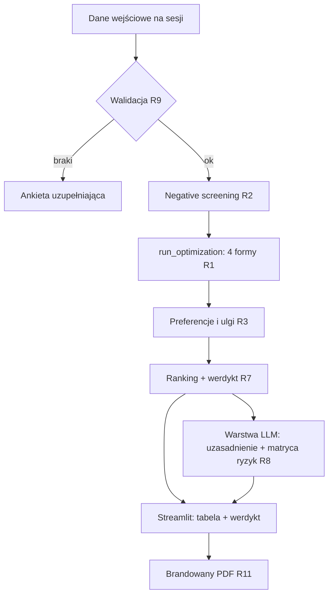

# feat: Silnik Optymalizacji Podatkowej 2026 (Streamlit MVP)

## Przegląd

Narzędzie doradcze dla biura Abacus, które dla danej JDG porównuje cztery formy opodatkowania na rok 2026 (skala, liniowy, ryczałt, sp. z o.o.), wskazuje najkorzystniejszą i produkuje brandowany PDF do sesji doradczej z klientem. Kluczowa zasada architektoniczna: **cała matematyka jest deterministyczna (Python), a model językowy generuje wyłącznie warstwę narracyjną** (uzasadnienie + matryca ryzyk) na podstawie gotowych liczb. Spec to dopracowany prompt z tej sesji; w MVP staje się on specyfikacją silnika + instrukcją dla warstwy LLM, a nie kalkulatorem.

## Ujęcie problemu

Podczas sesji doradczych (listopad–grudzień, pilotaż wrzesień 2026) doradca potrzebuje w kilka minut policzyć i porównać formy opodatkowania dla konkretnego klienta i wręczyć mu wiarygodny, brandowany dokument. Liczenie ręczne jest wolne i podatne na błędy, a oddanie matematyki modelowi językowemu grozi zaokrągleniami i gubieniem progów — przy rekomendacji, którą klient traktuje jako twardą, to niedopuszczalne. Potrzebny jest deterministyczny silnik z testami, oddzielony od UI i od narracji.

## Śledzenie wymagań

- R1. Deterministyczne policzenie czterech form wg parametrów 2026: skala, liniowy, ryczałt, sp. z o.o.
- R2. Negative screening: `byly_pracodawca`=TRUE blokuje ryczałt i liniowy; przychód > 2 mln EUR blokuje ryczałt.
- R3. Obsługa wspólnego rozliczenia (próg 240 000 zł, podwójna kwota wolna 60 000 zł) oraz ulg: dzieci, 4+, IP-Box (5%), IKZE.
- R4. Poprawny rok składkowy zdrowotny: minimum roczne = 5 072,90 zł (1×314,96 + 11×432,54); limit odliczenia liniowy 14 100 zł; ryczałt — 50% zapłaconej zdrowotnej pomniejsza przychód.
- R5. ZUS wg parametru (Duży / Mały ZUS Plus / Preferencyjny / Ulga na start / Etat-zbieg) z rocznym ograniczeniem podstawy emerytalno-rentowej 282 600 zł.
- R6. Sp. z o.o.: jawne założenie wypłaty (np. 100% zysku dywidendą), wyjątek jednoosobowej sp. z o.o. (dodatkowa zdrowotna + ZUS wspólnika), opcjonalna ścieżka art. 176 KSH.
- R7. Wyjście zgodne z kontraktem UI: tabela porównawcza, werdykt matematyczny, max 3 punkty uzasadnienia, matryca ryzyk; styl menedżerski per „Pan/Pani".
- R8. Warstwa LLM generuje wyłącznie narrację z gotowych liczb — nie wykonuje obliczeń.
- R9. Walidacja danych wejściowych: przy braku przychodu / kosztów / kodu PKWiU lub charakteru usług — zatrzymanie i konkretna ankieta uzupełniająca.
- ~~R10. „Profil klienta": zapis i odczyt parametrów klienta (Supabase).~~ **USUNIĘTE ze scope'u (2026-06-22):** narzędzie działa „tu i teraz", bez trwałego zapisu danych klientów. Brak Supabase i jakiejkolwiek persystencji — dane wprowadzane na sesji, wynik to ekran + PDF.
- R11. Brandowany PDF (styl Abacus, gradient navy `#0d1b2a → #1b2d45`) jako deliverable sesji.

## Granice scope'u

- **Estoński CIT i ewentualna piąta forma — poza MVP.** Dopracowany prompt obejmuje 4 formy; wcześniejszy stress-test narzędzia wspominał o 5 formach i trzech rankingach. Do potwierdzenia przed implementacją (zob. Otwarte pytania). MVP planowany pod 4 formy.
- Brak multi-user / auth — narzędzie jednostanowiskowe na sesje doradcze.
- **Brak jakiejkolwiek persystencji danych (decyzja 2026-06-22).** Bez bazy, bez Supabase, bez „Profilu klienta" — narzędzie weryfikuje dane wprowadzone na sesji i zwraca wynik + PDF. Eliminuje to ryzyka RODO/przechowywania danych klientów.
- Brak automatycznej integracji z Enova365 / Frappe CRM — dane wprowadzane ręcznie lub importowane z PDF KPiR (Unit 7). Integracja API to osobny etap.
- **Import KPiR tylko z PDF tekstowych** (eksport z programu księgowego). Skany wymagałyby OCR — poza scope.
- Brak automatycznego pobierania stawki ryczałtu z PKWiU — doradca wskazuje stawkę (z podpowiedzią).
- Brak rozliczeń wstecznych / korekt — narzędzie liczy prognozę na rok 2026.

## Kontekst i research

### Relevantny kod i wzorce (z ekosystemu Abacus)

- **Wzorzec „pure engine + UI"**: `run_audit` z audytora KPiR oraz `symfonia_year_end_auditor.py` — czysta funkcja obliczeniowa oddzielona od Streamlit. Powielić jako `run_optimization(dane) -> WynikOptymalizacji`.
- **Branding**: gradient navy `#0d1b2a → #1b2d45` ustalony w audytorze Symfonia i powielany w kolejnych narzędziach — użyć w UI i PDF.
- **Supabase przez HTTPS**: w „Generator masowych pism" port 5432 był zablokowany, więc dostęp idzie przez `supabase-py` po HTTPS. Tę samą ścieżkę przyjąć dla „Profilu klienta".
- **Warstwa AI z narracją + wizualizacjami**: „Generator Sprawozdań Zarządu" (Claude API + python-docx + matplotlib, narracja AI + 3 wizualizacje) — wzorzec dla warstwy LLM i dla PDF.
- **Dziennik decyzji / reguły**: „Analyzer Oszczędności" — wzorzec rozdzielenia reguł systemowych od danych; może posłużyć przy parametryzacji 2026.

### Referencje zewnętrzne (parametry 2026, zweryfikowane)

- Minimalna składka zdrowotna 432,54 zł/mies od lutego 2026 (ZUS); 314,96 zł za styczeń 2026 (koniec starego roku składkowego).
- Limit odliczenia zdrowotnej liniowy: 14 100 zł (Obwieszczenie MF z 12.12.2025, M.P. poz. 1274).
- Ryczałt — zdrowotna od 60/100/180% przeciętnego (9 228,64 zł): 498,35 / 830,58 / 1 495,04 zł mies.
- Duży ZUS społeczne (z chorobowym + FP) 1 926,76 zł/mies (podstawa 5 652,00 zł); preferencyjny 456,18 zł; Mały ZUS Plus 456–1 927 zł.
- Roczne ograniczenie podstawy emerytalno-rentowej 282 600 zł. Reforma składki zdrowotnej zawetowana — obowiązuje konstrukcja z Polskiego Ładu.

## Kluczowe decyzje techniczne

- **Rozdział silnik / narracja / UI**: deterministyczny rdzeń, warstwa LLM tylko narracyjna, Streamlit jako prezentacja. Uzasadnienie: poprawność liczb i testowalność rdzenia niezależnie od modelu i UI.
- **Stałe 2026 w jednym module**: wszystkie parametry roczne w jednym `params_2026.py`/strukturze, by aktualizacja na 2027 była jednym miejscem zmiany.
- **Minimum zdrowotnej jako stała 5 072,90 zł**: zaszyta i pokryta testem, by model ani kod nie policzył 12×432,54.
- ~~**Supabase po HTTPS (`supabase-py`)**~~ **Nieaktualne (2026-06-22): brak persystencji — żadnej bazy.** Narzędzie jest bezstanowe między sesjami.
- **Graceful degradation warstwy LLM**: jeśli API niedostępne, narzędzie i tak pokazuje tabelę + werdykt (liczby), a sekcje narracyjne oznacza jako niedostępne.

## Otwarte pytania

### Rozwiązane podczas planowania

- Architektura silnik vs LLM: rozdzielone (silnik liczy, LLM opisuje).
- Minimum zdrowotnej: 5 072,90 zł jako stała.
- Dostęp do Supabase: HTTPS przez `supabase-py`.

### Wymagające decyzji przed implementacją (blokujące scope)

- **4 czy 5 form?** MVP zaplanowany pod 4 formy zgodnie z promptem. Jeśli pilotaż wymaga estońskiego CIT i trzech rankingów (jak w starszym stress-teście), zwiększa to scope Unitów 1, 2, 5, 6 — wymaga potwierdzenia.

### Odroczone do implementacji

- Wybór biblioteki PDF (reportlab vs HTML→PDF/WeasyPrint) — zależny od jakości brandingu i wizualizacji.
- Dokładny model „Profilu klienta" w Supabase (kolumny stałe vs EAV) — po dotknięciu istniejącego schematu z innych narzędzi.
- Dokładny kształt wizualizacji w PDF (jeśli w ogóle w MVP).

## Diagram przepływu

## Implementation Units

- [x] **Unit 1: Stałe podatkowe 2026 + modele danych**

**Cel:** Jedno źródło prawdy dla parametrów 2026 oraz typowane modele wejścia/wyjścia silnika.

**Wymagania:** R4, R5

**Zależności:** Brak

**Pliki:**
- Stwórz: `optymalizator/params_2026.py`
- Stwórz: `optymalizator/models.py`
- Test: `tests/test_models.py`

**Podejście:**
- W `params_2026.py`: minimalne wynagrodzenie 4 806, przeciętne 9 420, przeciętne sektor IV kw. 9 228,64, minimum zdrowotnej roczne 5 072,90, progi/stawki skali (12%/32%, próg 120 000, kwota zmniejszająca 3 600), limit odliczenia liniowy 14 100, progi ryczałtu (498,35/830,58/1 495,04), kwoty ZUS (Duży 1 926,76; Preferencyjny 456,18; podstawy Mały ZUS Plus 1 441,80–5 652,00), roczne ograniczenie podstawy 282 600, CIT 9%, efektywne dywidendy 0,7371.
- W `models.py`: `DaneKlienta` (przychód, koszty, stawka_ryczałtu/charakter usług, forma ZUS, flagi: byly_pracodawca, wspolne_rozliczenie, ulgi, art_176, jednoosobowa_spzoo, dochód małżonka), `WynikFormy` (podatek, zdrowotna, zus_spoleczny, dochod_netto, dostepnosc), `WynikOptymalizacji` (lista WynikFormy, werdykt, różnica do drugiej opcji).

**Wzorce do naśladowania:**
- `analyzer/models.py` (Analyzer Oszczędności) — styl dataclass/pydantic.

**Scenariusze testowe:**
- Stałe mają oczekiwane wartości (regresja na liczbach 2026).
- Model wejścia odrzuca brak wymaganych pól zgodnie z R9.

**Weryfikacja:**
- Import modułu zwraca komplet stałych 2026; modele walidują się poprawnie.

---

- [x] **Unit 2: Silnik deterministyczny `run_optimization`**

**Cel:** Czysta funkcja licząca cztery formy, screening, preferencje i werdykt — bez UI i bez LLM.

**Wymagania:** R1, R2, R3, R4, R6, R7 (część liczbowa)

**Zależności:** Unit 1

**Pliki:**
- Stwórz: `optymalizator/engine.py` (sygnatura projektowa: `run_optimization(dane: DaneKlienta) -> WynikOptymalizacji`)
- Test: `tests/test_engine.py`

**Podejście:**
- Wzór nadrzędny identyczny dla wszystkich: `dochód_netto = przychód − koszty − zus_spoleczny − zdrowotna − podatek`.
- Skala: D = przychód−koszty−ZUS; podatek 12%×min(D,120k)−3 600 lub 10 800+32%×(D−120k), nie <0, minus ulgi; zdrowotna 9%×D nie mniej niż minimum; brak odliczenia.
- Liniowy: zdrowotna 4,9%×D, minimum; odliczenie = min(zdrowotna, 14 100) pomniejsza D; podatek 19%.
- Ryczałt: **koszty nie wchodzą do podstawy**; podstawa = przychód − ZUS − 50%×zdrowotna; podatek = stawka×podstawa; zdrowotna stała wg progu.
- Sp. z o.o.: CIT 9%, dywidenda efektywnie 26,29% (mnożnik 0,7371); jawne założenie wypłaty; wyjątek jednoosobowej (dodatkowa zdrowotna + ZUS); ścieżka art. 176 jeśli flaga.
- Screening (Krok 1) i preferencje/ulgi/wspólne rozliczenie (Krok 2) jako osobne, czyste sub-funkcje wołane wewnątrz `run_optimization`.

**Notatka wykonawcza:** Zacznij test-first — to rdzeń finansowy, poprawność liczb jest krytyczna. Najpierw failing testy na scenariuszach poniżej, potem implementacja.

**Wzorce do naśladowania:**
- `run_audit` (audytor KPiR) — pure-function, oddzielenie logiki od UI.

**Scenariusze testowe:**
- Wysoki dochód, niskie koszty → ryczałt korzystniejszy niż skala/liniowy.
- Wysokie koszty → skala/liniowy biją ryczałt (bo ryczałt nie odejmuje kosztów).
- `byly_pracodawca`=TRUE → ryczałt i liniowy oznaczone NIEDOSTĘPNE; werdykt tylko spośród dostępnych.
- Przychód > 2 mln EUR → ryczałt NIEDOSTĘPNY.
- Wspólne rozliczenie, małżonek bez dochodu → skala zyskuje przez podwójną kwotę wolną i próg.
- Dochód bardzo niski / strata → zdrowotna = minimum 5 072,90 zł (NIE 12×432,54).
- Liniowy, zapłacona zdrowotna > 14 100 → odliczenie capped na 14 100.
- Ryczałt II próg (830,58) → 50% zapłaconej zdrowotnej pomniejsza przychód.
- Jednoosobowa sp. z o.o. → doliczona zdrowotna + ZUS wspólnika; wynik różny od wieloosobowej.
- Dochód przekraczający 282 600 → emerytalna/rentowa naliczone do limitu.

**Weryfikacja:**
- Wszystkie scenariusze przechodzą; werdykt zwraca poprawną różnicę kwotową do drugiej opcji; suma kontrolna minimum zdrowotnej = 5 072,90 zł.

---

- [x] ~~**Unit 3: Profil klienta + Supabase (CRUD)**~~ **USUNIĘTE ze scope'u (2026-06-22).**

Decyzja: narzędzie nie zapisuje danych — weryfikacja „tu i teraz" + PDF. Brak Supabase, brak `profil_repo.py`, brak persystencji. R10 wycofane. Jeśli w przyszłości pojawi się potrzeba współdzielenia profili między stanowiskami, wraca jako osobny etap (preferowany lokalny SQLite za interfejsem repozytorium przed chmurą).

---

- [x] **Unit 4: Warstwa narracyjna LLM**

**Cel:** Wygenerować „Kluczowe Uzasadnienie" (max 3 punkty) i „Matrycę Ryzyk" z gotowych liczb, w stylu per „Pan/Pani".

**Wymagania:** R7 (narracja), R8

**Zależności:** Unit 2

**Pliki:**
- Stwórz: `optymalizator/narracja.py`
- Test: `tests/test_narracja.py`

**Podejście:**
- Wejście: `WynikOptymalizacji` (gotowe liczby) → prompt strukturalny (część narracyjna dopracowanego specu) → Claude API (model klasy Sonnet).
- Model NIE liczy — w prompcie zakaz przeliczania, dostaje liczby jako dane.
- Graceful degradation: brak/awaria API → zwróć placeholdery i flagę „narracja niedostępna", UI/PDF pokazują liczby.

**Wzorce do naśladowania:**
- Warstwa AI z „Generator Sprawozdań Zarządu" (Claude API + narracja).

**Scenariusze testowe:**
- Dla ustalonego `WynikOptymalizacji` zwraca ≤3 punkty uzasadnienia i sekcję ryzyk (mock API).
- Awaria API → degradacja bez crasha, flaga ustawiona.

**Weryfikacja:**
- Narracja spójna z werdyktem; brak prób przeliczeń; degradacja działa.

---

- [x] **Unit 5: UI Streamlit**

**Cel:** Formularz wejściowy + checkboxy ulg, render tabeli porównawczej i werdyktu w brandingu Abacus.

**Wymagania:** R3, R7, R9

**Zależności:** Unit 1, 2, 4

**Pliki:**
- Stwórz: `app.py`
- Stwórz: `optymalizator/ui_components.py`
- Test: `tests/test_ui_smoke.py` (smoke / import)

**Podejście:**
- Formularz: przychód, koszty, charakter usług / stawka ryczałtu, forma ZUS (radio), flagi (były pracodawca, wspólne rozliczenie, jednoosobowa sp. z o.o., art. 176), checkboxy ulg, dochód małżonka, dochód z poprzedniego roku (dla Małego ZUS Plus).
- Walidacja R9: przy brakach — komunikat + konkretna ankieta, bez liczenia.
- Render: tabela 4 form, werdykt, sekcje narracyjne z Unit 4; gradient navy `#0d1b2a → #1b2d45`.

**Wzorce do naśladowania:**
- Streamlit + branding z audytora Symfonia; multipage z „Generator masowych pism".

**Scenariusze testowe:**
- Wprowadzenie kompletnych danych → tabela + werdykt renderują się.
- Brak kosztów / PKWiU → ankieta, brak obliczeń.

**Weryfikacja:**
- Aplikacja startuje, happy-path renderuje wynik, walidacja blokuje braki.

---

- [x] **Unit 6: Generator brandowanego PDF**

**Cel:** Wyeksportować wynik sesji jako brandowany PDF (Abacus) — deliverable dla klienta.

**Wymagania:** R11

**Zależności:** Unit 2, 4, 5

**Pliki:**
- Stwórz: `optymalizator/pdf_export.py`
- Test: `tests/test_pdf_export.py`

**Podejście:**
- Sekcje: nagłówek z brandingiem, tabela porównawcza, werdykt matematyczny, uzasadnienie, matryca ryzyk.
- Styl per „Pan/Pani"; gradient/navy Abacus; stopka z zastrzeżeniem doradczym.
- Biblioteka PDF — odroczone (reportlab vs HTML→PDF); decyzja po próbie brandingu.

**Wzorce do naśladowania:**
- PDF/branding z narzędzi Abacus; matplotlib z „Generator Sprawozdań Zarządu" jeśli wizualizacje wejdą.

**Scenariusze testowe:**
- Dla ustalonego wyniku generuje niepusty PDF z wszystkimi sekcjami.
- Degradacja narracji (Unit 4) → PDF nadal zawiera tabelę i werdykt.

**Weryfikacja:**
- PDF otwiera się, zawiera komplet sekcji i branding.

---

- [x] **Unit 7: Import KPiR z PDF** (dodany 2026-06-22 na życzenie użytkownika)

**Cel:** Wczytać roczne podsumowanie KPiR (PDF) i automatycznie wypełnić przychód i koszty, by doradca nie przepisywał liczb ręcznie na sesji.

**Wymagania:** wsparcie R9 (przyspiesza wprowadzanie danych, ale doradca potwierdza)

**Zależności:** Unit 5

**Pliki:**
- Stwórz: `optymalizator/kpir_import.py` (`parsuj_kpir(zrodlo) -> ImportKPiR`)
- Test: `tests/test_kpir_import.py` (na realnej próbce, `skipif` gdy brak pliku)

**Podejście:**
- `pdfplumber` czyta tekst PDF; parsujemy **etykietowany blok podsumowania** (przychód, koszty z uwzgl. różnicy reman., dochód, wydatki, zakupy, remanent), NIE rozbicie miesięczne (siatka miesięczna bywa nieczytelna przy ekstrakcji).
- Dopasowanie **tolerancyjne** (regex na fragmentach) — odporne na zniekształcenia fontów (np. „Przychód"→„Przvch?d") i różne układy programów księgowych.
- Mieszane separatory (`0,00` / `0.00`, spacja jako tysiące) obsłużone w `kwota_pl`.
- **Kontrola spójności księgowej**: przychód − koszty = dochód → flaga `spojnosc`; rozjazd → ostrzeżenie.
- **Parser proponuje, doradca potwierdza** — wartości trafiają do pól formularza (`st.session_state`) do edycji przed liczeniem; brak cichego wpływu na rekomendację.
- Graceful: złe wejście / skan (brak tekstu) → `ostrzezenia`, bez wyjątku; ręczne wprowadzanie nadal działa.

**Scenariusze testowe:**
- Realna próbka → przychód 5 207 580,87; koszty (z reman.) 4 635 139,45; dochód 572 441,42.
- Kontrola spójności = True, brak ostrzeżeń.
- Pełny odczyt podsumowania (wydatki, zakupy, koszty uz. przychodu, różnica remanentowa).
- Wejście niebędące PDF → ImportKPiR z ostrzeżeniem, bez crasha.

**Weryfikacja:**
- Import wypełnia pola; doradca widzi liczby i status spójności; może je nadpisać.

**Uwaga o scope:** „pełny odczyt" dotyczy etykietowanego podsumowania (wszystkie sumy roczne) — rozbicie miesięcznych pozycji nie jest wiarygodnie odzyskiwalne z tego typu eksportu i nie jest potrzebne optymalizatorowi (liczą się sumy roczne).

## Wpływ systemowy

- **Graf interakcji:** UI → engine → narracja → pdf. Narzędzie bezstanowe, brak warstwy danych.
- **Propagacja błędów:** błąd LLM nie może wywrócić liczenia ani PDF (graceful degradation narracji).
- **Ryzyka cyklu życia stanu:** stan formularza w `st.session_state`; uwaga na nadpisanie pól przy wyborze profilu.
- **Parytet API:** kontrakt `WynikOptymalizacji` współdzielony przez UI i PDF — jedna zmiana, oba konsumenty.

## Ryzyka i zależności

- **Poprawność podatkowa** — najwyższe ryzyko; mitygacja: test-first w Unit 2, stałe 2026 w jednym miejscu, suma kontrolna minimum zdrowotnej.
- **Sp. z o.o. nieporównywalna 1:1 z JDG** — wynik zależy od założenia wypłaty; mitygacja: jawne wyświetlanie założenia, nie udawać jednej pewnej liczby.
- **Zależność od zewnętrznego API (Claude, Supabase)** — mitygacja: graceful degradation w obu.
- **Scope 4 vs 5 form** — może urosnąć; zablokowane do potwierdzenia.

## Rozważane alternatywy

- **Liczenie przez LLM (prompt jako kalkulator)** — odrzucone: ryzyko zaokrągleń i gubienia progów w narzędziu o charakterze rekomendacji.
- **PostgreSQL bezpośrednio (port 5432)** — odrzucone: zablokowany w środowisku; stąd Supabase po HTTPS.

## Fazowe dostarczanie

- **Faza 1 (rdzeń):** Unit 1 + Unit 2 — silnik z testami; już użyteczny do walidacji liczb (np. odpalany lokalnie/CLI). ✅ **UKOŃCZONE** (30 testów przechodzi).
- **Faza 2 (sesja):** Unit 5 — UI Streamlit; doradca liczy na sesji (bez profili/persystencji).
- **Faza 3 (deliverable):** Unit 4 + Unit 6 — narracja i brandowany PDF. ✅ **UKOŃCZONE** (fpdf2, font Arial Unicode, graceful degradation narracji).

> **Status końcowy (2026-06-22):** wszystkie Unity w scope (1, 2, 4, 5, 6) zaimplementowane test-first, 44 testy przechodzą. Unit 3 (Supabase) usunięty świadomą decyzją. Stack: Python 3.12, dataclasses (rdzeń bez zależności), Streamlit (UI), anthropic SDK (narracja), fpdf2 (PDF). Uruchomienie: `.venv\Scripts\streamlit run app.py`.

## Źródła i referencje

- Dokument źródłowy: dopracowany prompt „Silnik Optymalizacji Podatkowej 2026" (pełna wersja z tej sesji).
- Parametry 2026: ZUS, Obwieszczenie MF z 12.12.2025 (M.P. poz. 1274), obwieszczenia GUS.
- Wzorce ekosystemu Abacus: `run_audit` (audytor KPiR), `symfonia_year_end_auditor.py`, Generator Sprawozdań Zarządu, Generator masowych pism, Analyzer Oszczędności.
